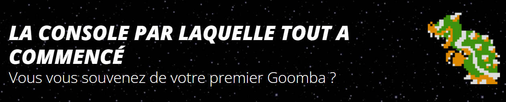
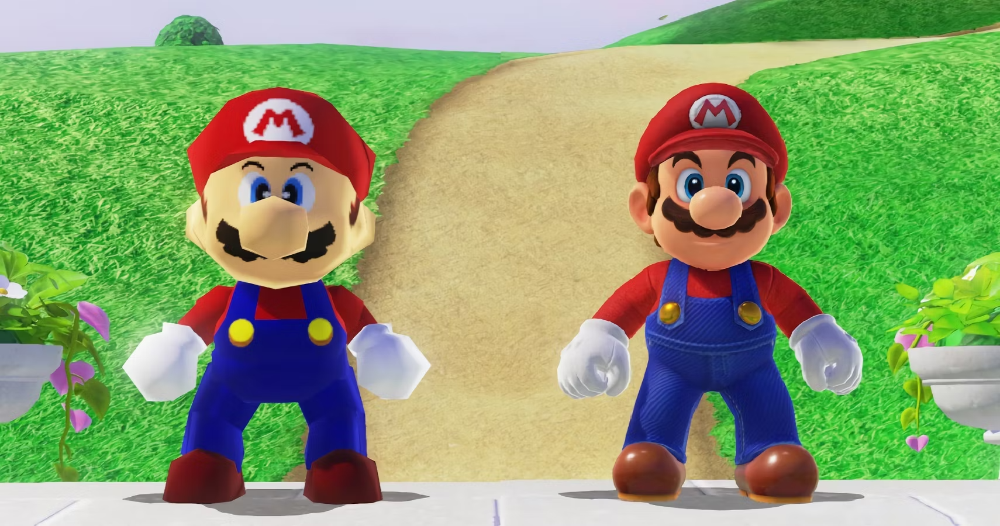

# Master thesis

## Technostalgie & jeux vidéo

## Motivation

Ce sujet m'est venu en ayant moi-même un sentiment nostalgique sur des jeux Nintendo. Sentiment qui m'a poussé à prendre un abonnement sur ma switch au [**Nintendo switch online**](https://www.nintendo.com/fr-fr/Nintendo-Switch-Online/Nintendo-Switch-Online-Pack-additionnel/Nintendo-Switch-Online-Pack-additionnel-2060571.html) pour accéder aux classiques de la Nintendo 64. Ainsi, je me suis rendu compte de la différence qu'il y avait entre mes souvenirs et le jeu réel auquel j'étais entrain de jouer.

J'étais comme déçue, mais en même temps contente de pouvoir rejouer aux jeux que j'avais fait étant enfant. L'idéalisation que j'en avais fait était flagrante. C'est également en faisant quelques recherches sur des forums tels que reddit, je suis tombé sur ce post d'un internaute qui soulignait, selon lui les problèmes liés à la nostalgie qu'il ressent lorsqu'il joue à des jeux. Je me suis donc penché sur cette thématique de la technostalgie et les jeux vidéo.

**Constat campagne marketing Nintendo - Nintendo mini classic**

> Ravivez vos souvenirs et créez-en de nouveaux avec la nouvelle expérience rétro-gaming de Nintendo. Nintendo, [Slogan du revival](https://www.nintendo.com/fr-fr/Divers/Nintendo-Classic-Mini-Nintendo-Entertainment-System/Nintendo-Classic-Mini-Nintendo-Entertainment-System-1124287.html)

# Comment certains jeux capitalisent sur la nostalgie pour attirer un public spécifique ?

> Mario 64 VS Super Mario Odyssey

# Définitions

**Technostalgie** : La technostalgie se manifeste par une vague de nostalgie lorsqu'on aperçoit un ancien appareil autrefois utilisé, en ayant oublié ses limites ou les raisons de son remplacement. C'est une idéalisation des technologies obsolètes d'une époque passée, que l'on ait vécu cette époque ou non, par désir d'authenticité et en contraste avec le numérique moderne.

**Nostalgie** : À l'origine, le terme désignait le mal du pays. Il est souvent utilisé pour exprimer une mélancolie et un regret des temps passés ou des lieux disparus ou éloignés, auxquels on associe, souvent après coup, des souvenirs agréables.

**Retrogaming** : Un terme englobant l'ensemble des activités liées à la pratique, la collection et l'entretien des anciens jeux vidéo, des consoles rétro et de leurs accessoires, y compris les bornes d'arcade. Cependant, tous les joueurs n'ont pas grandi avec les mêmes consoles ni les mêmes jeux. Ce qui est considéré comme rétrogaming pour certains peut sembler encore récent pour d'autres. Chaque génération entretient une relation différente avec le rétrogaming.

# Points clés, notions du sujet

1. Etudier les "types" de nostalgies (personnelle, historique) et ces différentes définitions/nuancer ces definitions. **Pourquoi/Comment elles se "transmette" entre différentes generations n'ayant pas le même contexte ? (par exemple Pokémon)**

2. Étudier comment les jeux vidéo qui s'inspirent des esthétiques et des mécaniques des anciens jeux et consoles sont perçus par les joueurs actuels. **Comment les joueurs vivent cette nostalgie?**

3. Analyser comment certains jeux reprennant volontairement des aspects, caractéristiques d'anciens jeux et anciennes consoles pour attirer un public spécifique : 
   **Quelques exemples**

   - Hollow Knight -> Super Metroid (Metroidvania) : Souvent comparé pour savoir lequel est le meilleur, et montrer comment Hollow Knight reprends les codes de Super Metroid (gameplay, combat, sound design, world design)

     > Hollow Knight est peut-être le meilleur Metroidvania jamais créé, c'est un jeu presque parfait. Est-ce mieux que Super Metroid ? Peut-être que c'est le cas, il me faudrait encore quelques années à jouer à Hollow Knight pour en être sûr, mais c'est le seul metroidvania qui m'a jamais fait douter de la place de Super Metroid sur le trône du genre. Les deux jeux sont excellents et le resteront longtemps. [Temoignage Reddit](https://www.reddit.com/r/HollowKnight/comments/7em6ds/how_does_this_game_compare_to_super_metroid/)

   - Stardew Valley -> Harvest Moon : Comparaison frequente car Stardew Valley s'est fortement inspiré de la série de jeux vidéo Harvest Moon

     > En tant que joueur ayant de l'expérience dans les deux jeux, il m'est difficile de prendre une décision car, même si Stardew Valley apporte des aspects plus rafraîchissants tels que l'adoption, le combat et l'artisanat, Harvest Moon a une valeur de nostalgie si vous avez joué à ce jeu avant la sortie de Stardew Valley. Je suppose que ce que j'essaie de dire, c'est que Harvest Moon a son charme en tant que l'un des classiques et Stardew Valley a sa connaissance innovante des pixels indé-modernes que Harvest Moon n'a tout simplement pas...[Temoignage Reddit](https://www.reddit.com/r/StardewValley/comments/6955h9/stardew_valley_vs_harvest_moon/#:~:text=As%20a%20gamer%20who%20has,before%20Stardew%20Valley%20came%20out.)

   - Aspect marketing dirigé vers le retro-gaming (Par expl Nintendo)

4. Determiner les différents types de joueurs touchés par cette thématique (joueurs orientés retro-gaming, joueurs réguliers)

# Méthode, processuss

1. Interviews de differentes personnes : Me permettrais de définir plus précisément quels jeux procurent ce sentiment nostalgique, en croisant les données sur leurs âges, leurs premiers jeux, faire un rapprochement avec les jeux actuels qui jouent sur ce sentiment

   - Joueurs réguliers [Guide d'interview](../../method/Interview-Guide.md)
   - Créateurs de jeu vidéo (Guide d'interview à venir)
   - Psychologues ? (Guide d'interview à venir)

2. Etudier/Analyser 2-3 jeux/licences, quelques exemples (à definir):

   - Les licences de jeux Nintendo tels que **The Legend of Zelda, Animal crossing, Super Mario Bros.**
   - Rayman
   - Les sims
   - Reboot & Remake :

     - Tomb Raider (2013) -> Original : Tomb Raider (1996)
     - Mortal Kombat (2011) -> Original : Mortal Kombat (1992)
     - Final Fantasy VII Remake (2020) -> Original : Final Fantasy VII (1997)
     - Resident Evil 2 (2019) -> Original : Resident Evil 2 (1998)
     - The Legend of Zelda: Link's Awakening (2019) -> Original : The Legend of Zelda: Link's Awakening (1993)

3. User tests ? Plusieurs jeux basés sur la retranscription des interviews, demander à ces mêmes personnes de jouer a des jeux plus récents qui se rapproche de leurs jeux d'enfance

4. Analyses littéraires

# References

## Articles

1. [Comment les sentiments nostalgiques affectent les joueurs de Pokémon Go – intégrer la nostalgie de la marque de l'enfance dans la théorie de l'acceptation de la technologie](https://www.tandfonline.com/doi/full/10.1080/0144929X.2019.1662486?scroll=top&needAccess=true)
2. [Retromedia-in-practice: A practice theory approach for rethinking old and new media technologies](https://journals.sagepub.com/doi/abs/10.1177/1354856519842805)
3. [Polaroid 2.0. Photo-Objects and Analogue Instant Photography in the Digital Age](https://www.researchgate.net/publication/305266106_Polaroid_20_Photo-Objects_and_Analogue_Instant_Photography_in_the_Digital_Age)

## Livres

5. [Nostalgies contemporaines - Emmanuelle Fantin, Sébastien Fevry, **Katharina Niemeyer**](https://www.septentrion.com/FR/livre/?GCOI=27574100484050)

## Vidéos

6. [Le joueur du grenier](https://www.youtube.com/@joueurdugrenier)
